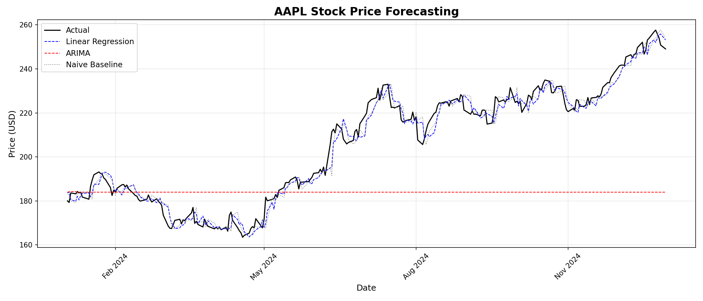

# Stock_forecast# AAPL Stock Price Forecasting

## Overview
A machine learning pipeline that forecasts Apple (AAPL) stock closing prices 
using Linear Regression and ARIMA models, trained on 5 years of historical 
data from Yahoo Finance.

## Results

## Features
- Downloads live stock data via yfinance
- Feature engineering with lag variables and moving averages
- Compares 3 models: Naive Baseline, Linear Regression, ARIMA
- Evaluation using MAE, RMSE, and R²
- Predicts next day's closing price from latest market data
- Saves forecast chart as PNG

## Model Performance (Test Set)

| Model             | MAE   | RMSE  | R²     |
|-------------------|-------|-------|--------|
| Naive Baseline    | 3.13  | 4.19  | 0.9731 |
| Linear Regression | 3.03  | 3.88  | 0.9769 |
| ARIMA             | 27.48 | 33.61 | -0.7314|
